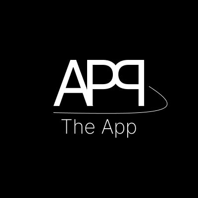

<h1 align="center">✨The App✨</h1>

###

App with a few ideas and concept

###

Short technical documentation available here:
[Technical documentation](https://docs.google.com/document/d/17HlOMCQ514EP88JFgSyusVXF5W095NSG6AIwu7y5C7w/edit?usp=sharing)

###

<h2 align="center">💻Tech Stack💻</h2>

###

  
  
  
  
  
  
  
  
  
  
  

###

# Running Instructions

## .NET 8.0 API

### Requirements

- [.NET SDK 8.0](https://dotnet.microsoft.com/download/dotnet/8.0)
- Visual Studio Code or Visual Studio (optional)

### Instructions

1. Clone this repository to your local machine.
2. Open a terminal in the directory containing the API project.
3. Run `dotnet restore` to install dependencies.
4. Then execute `dotnet build` to build the project.
5. To run the API, use `dotnet run`.
6. The API will be available at `http://localhost:5096`.

Swagger is available at: `http://localhost:5096/swagger/index.html`

## Angular Application

### Requirements

- [Node.js](https://nodejs.org/) (LTS version)
- Angular CLI (`npm install -g @angular/cli`)

### Instructions

1. Open a new terminal window and navigate to the directory containing the Angular project.
2. Run `npm install` to install all dependencies.
3. After installing dependencies, use `ng serve` command to start the development server.
4. The application will be available at `http://localhost:4200`.

## Connecting API with Angular Application

To connect the Angular application with the .NET 8.0 API, make sure the API endpoint is correctly configured in environment files or in the Angular application code.

## Database Connection

Remember to adjust ConnectionString or create Database of give properties `"Host=localhost;Database=AppDb;Username=postgres;Password=postgres"`

---

Ensure you have all the required software installed before attempting to run the projects. If you encounter any issues, refer to the documentation for each project or raise an issue in the repository. Good luck!

---

### A Few Screens of The App

###

---